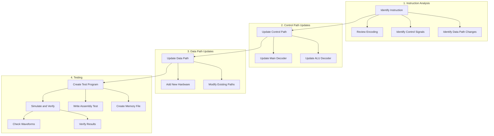
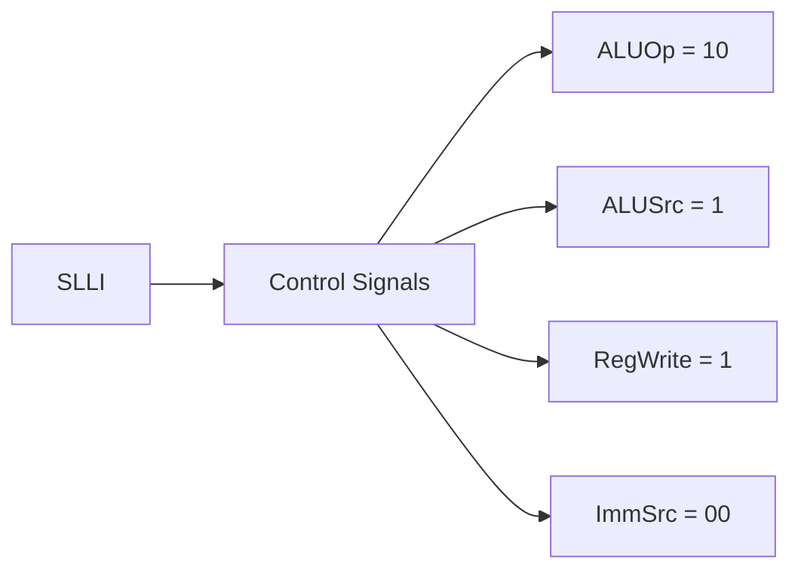
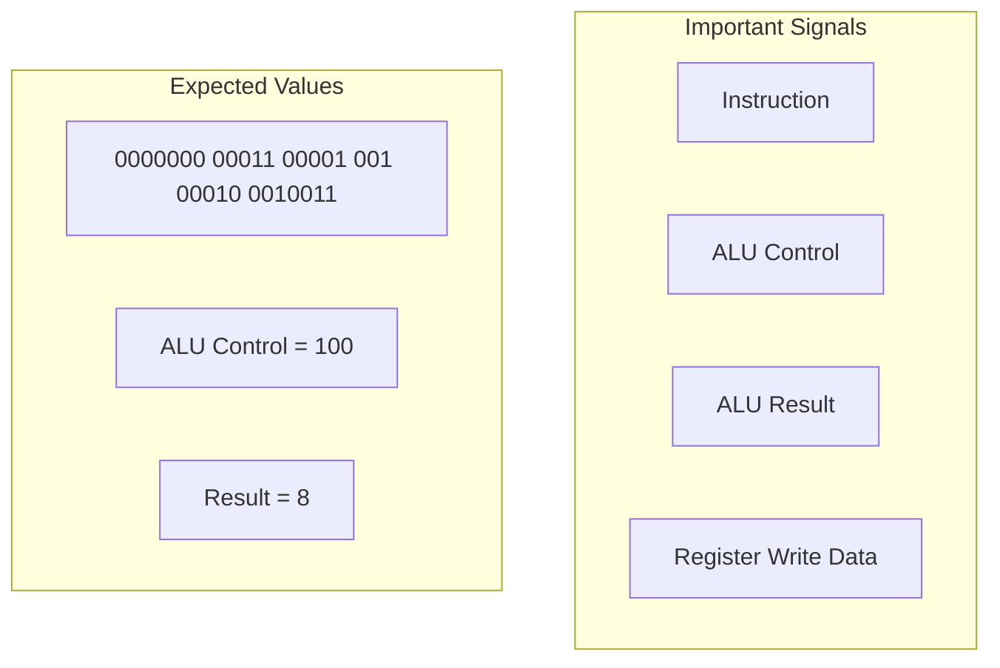
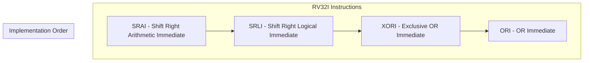

# Adding New RV32I Instructions

This guide explains how to add new instructions from the RV32I instruction set to the processor.

## Instruction Addition Process



## Step 1: Instruction Analysis

### Example: Adding SLLI (Shift Left Logical Immediate)
Instruction encoding:
```
31      25 24   20 19   15 14  12 11      7 6     0
+--------+--------+--------+------+---------+-------+
| 0000000| shamt  |  rs1   | 001  |   rd    |0010011|
+--------+--------+--------+------+---------+-------+
```

Required Control Signals:


## Step 2: Update Control Path

### Main Decoder Update
In `controller.sv`, add SLLI to the main decoder:

```systemverilog
// In maindec module
always_comb
    case(op)
        // Existing instructions...
        7'b0010011: begin // I-type ALU including SLLI
            controls = 11'b1_00_1_0_00_0_10_0;
            // RegWrite_ImmSrc_ALUSrc_MemWrite_ResultSrc_Branch_ALUOp_Jump
        end
```

### ALU Decoder Update
Add SLLI operation to ALU decoder:

```systemverilog
// In aludec module
always_comb
    case(ALUOp)
        2'b10: case(funct3) // R/I-type
            3'b001: ALUControl = 3'b100; // SLLI
```

## Step 3: Update Data Path

### ALU Update
Add shift left operation to ALU:

```systemverilog
// In alu module
always_comb
    case (alucontrol)
        3'b100:  result = a << b[4:0]; // SLLI
```

## Step 4: Testing

### Create Test Program
Create a new file `testing/slli.S`:

```assembly
# Test SLLI instruction
.text
.global _start

_start:
    # Test 1: Shift 1 left by 3
    li x1, 1
    slli x2, x1, 3      # x2 should be 8
    
    # Test 2: Shift 5 left by 2
    li x3, 5
    slli x4, x3, 2      # x4 should be 20
    
    # Store results
    li x5, 100
    sw x2, 0(x5)        # Store 8 at address 100
    sw x4, 4(x5)        # Store 20 at address 104
```

### Create Memory File
Use the RISC-V toolchain to create the memory file:

```bash
cd testing
make slli.memfile
```

### Update Test Verification
Modify `testbench` in `top.sv` to verify new test cases:

```systemverilog
// In testbench module
always @(negedge clk) begin
    if(MemWrite) begin
        if(DataAdr === 100 & WriteData === 8) begin
            // First test passed
        end else if(DataAdr === 104 & WriteData === 20) begin
            // Second test passed
            $display("SLLI Tests Succeeded");
            $stop;
        end else begin
            $display("SLLI Test Failed");
            $stop;
        end
    end
end
```

## Simulation and Verification

### Running the Test
```bash
cd hdl/sim
vsim -do riscv_single.do
```

### Key Signals to Watch


## Common Issues and Debugging

### Control Signal Issues
- Check main decoder output matches instruction needs
- Verify ALU operation code is correct
- Ensure immediate format selection is correct

### Data Path Issues
- Verify shift amount is correctly extracted from instruction
- Check ALU shift operation implementation
- Confirm result is properly written back to register file

### Testing Issues
- Use wave window to track instruction flow
- Check register values at each stage
- Verify memory writes occur at correct addresses

## Adding Other RV32I Instructions

Follow similar process for other instructions:

1. Analyze instruction encoding and required control signals
2. Update control path (main decoder and ALU decoder)
3. Modify data path if needed
4. Create test program
5. Update test verification
6. Simulate and verify

### Example Instructions to Add


Each instruction follows the same basic process, but may require different control signals and ALU operations.
