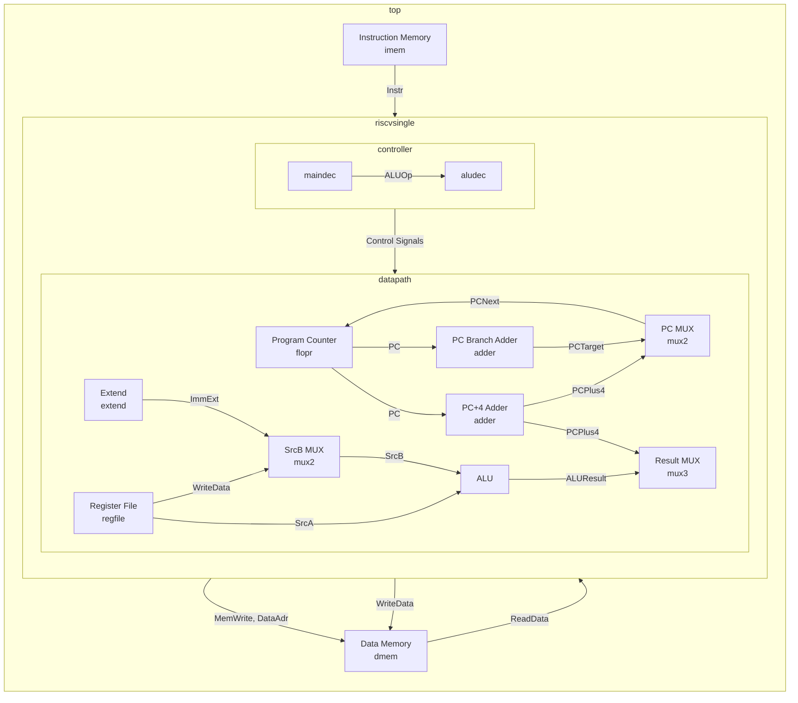

# Processor Architecture

This page details the architecture of our RISC-V Single Cycle processor implementation through various diagrams.

## Module Hierarchy

The following diagram shows the hierarchical structure of the processor modules:

```docusaurus
graph TD
    A[top] --> B[riscvsingle]
    A --> C[imem]
    A --> D[dmem]
    B --> E[controller]
    B --> F[datapath]
    E --> G[maindec]
    E --> H[aludec]
    F --> I[flopr]
    F --> J[adder]
    F --> K[regfile]
    F --> L[extend]
    F --> M[alu]
    F --> N[mux2]
    F --> O[mux3]
```

## Module Interconnections

The following diagram shows how the modules are connected and how data flows between them:



## Control Signals

The following control signals orchestrate the operation of the processor:

- **ResultSrc[1:0]**: Selects the result to write back to register file
  - 00: ALU Result
  - 01: Memory Read Data
  - 10: PC + 4

- **ImmSrc[1:0]**: Selects immediate extension type
  - 00: I-type
  - 01: S-type (stores)
  - 10: B-type (branches)
  - 11: J-type (jal)

- **ALUControl[2:0]**: Controls ALU operation
  - 000: Add
  - 001: Subtract
  - 010: AND
  - 011: OR
  - 101: SLT

- **ALUSrc**: Selects second ALU input
  - 0: Register
  - 1: Immediate

- **MemWrite**: Controls memory write
  - 0: Read
  - 1: Write

- **RegWrite**: Controls register file write
  - 0: No Write
  - 1: Write

- **PCSrc**: Selects next PC
  - 0: PC + 4
  - 1: Branch Target

- **Jump**: Indicates jump instruction
  - 0: Not Jump
  - 1: Jump
