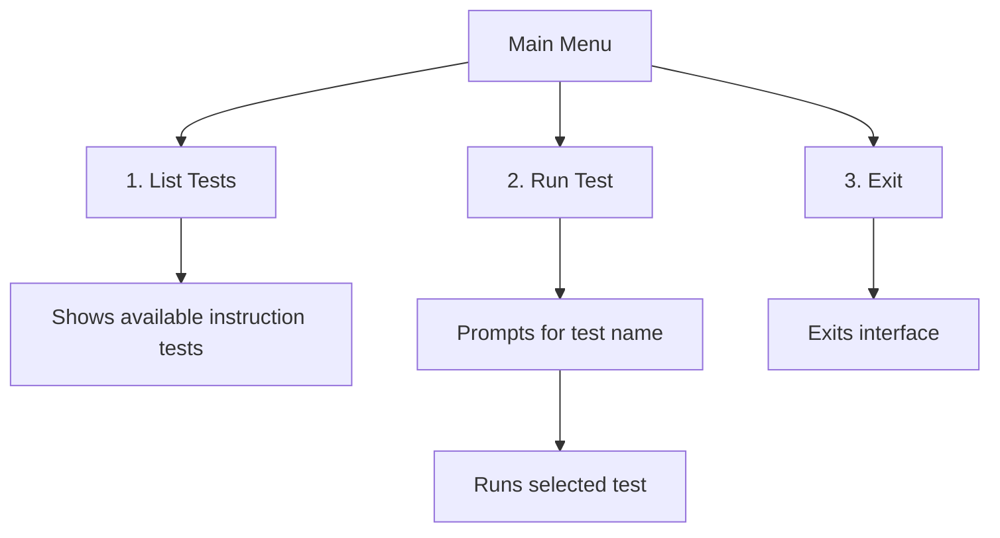
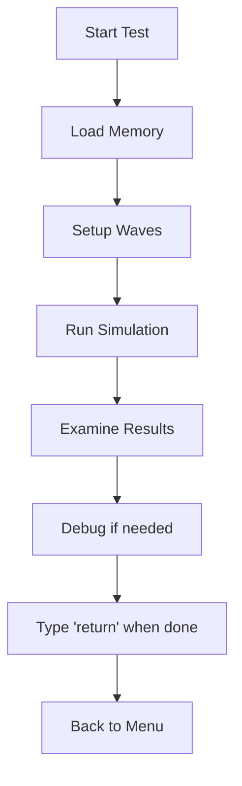
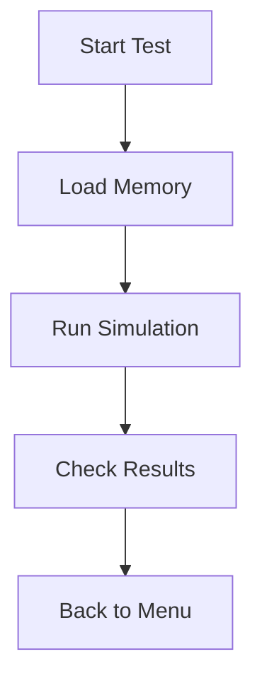
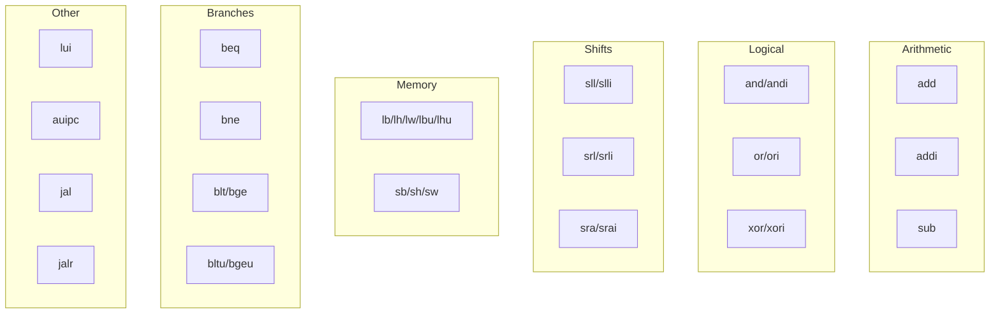
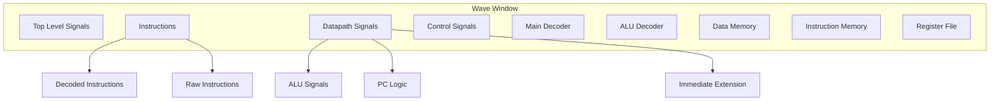

# Simulation Guide

This guide explains how to simulate the RISC-V single cycle processor using ModelSim/QuestaSim.

## Test Interface Modes

The test interface can be run in two modes:

### GUI Mode
```bash
cd hdl/sim
vsim -do run_test.tcl
```
- Provides wave window visualization
- Shows schematic view
- Interactive debugging capabilities
- Type 'return' in transcript to return to menu

### Batch Mode
```bash
cd hdl/sim
vsim -do run_test.tcl -c
```
- Command-line only
- Faster execution
- Suitable for automated testing

## Memory Organization

The processor uses two memory modules:
- Instruction Memory (1024 x 32-bit words)
- Data Memory (1024 x 32-bit words)

Memory Map:
```
Instruction Memory:
0x00000000 - 0x00000FFC: Program Storage (1024 words)

Data Memory:
0x00000000 - 0x00000FFC: Data Storage (1024 words)
```

## Using the Interface

The interface provides three options:



### GUI Mode Workflow



### Batch Mode Workflow



## Available Tests

The testing directory includes tests for all implemented RV32I instructions:



## GUI Mode Features

When running in GUI mode, you get access to:

### Wave Window Organization


### Interactive Debug Features
- Pause/Resume simulation
- Examine waves at any point
- View schematic diagram
- Check register contents
- Monitor memory values

## Common Issues and Solutions

1. Test Not Found
   - Verify test name matches exactly (e.g., "add" not "ADD")
   - Check if memfile exists in testing directory
   - Ensure proper file permissions

2. Wave Window Issues (GUI Mode)
   - Use View -> Wave if window not visible
   - Reset zoom with right-click -> Zoom -> Full
   - Add signals manually if needed

3. GUI Mode Navigation
   - Use 'return' command to go back to menu
   - Wave window remains interactive
   - Can run multiple tests sequentially

4. Memory File Issues
   - Memory files must be hex format
   - Maximum 1024 words per memory
   - Word-aligned addresses only

## Tips for Effective Testing

1. GUI Mode Best Practices
   - Examine waves after simulation
   - Use schematic view for signal tracing
   - Type 'return' when done examining
   - Clear workspace between tests

2. Batch Mode Best Practices
   - Good for quick verification
   - Check console output for results
   - Use for regression testing
   - Faster execution time

3. Understanding Test Results
   - Success: Test writes expected value
   - Failure: Wrong value or address
   - Timeout: Simulation reaches 300ns

4. Memory Usage
   - 1024 words available for instructions
   - 1024 words available for data
   - Word-aligned access only
   - Addresses in hex format
