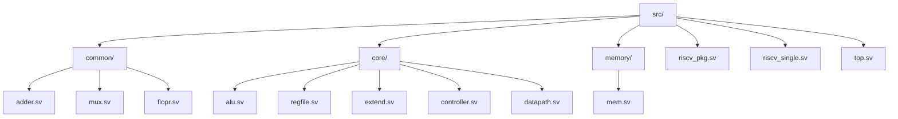
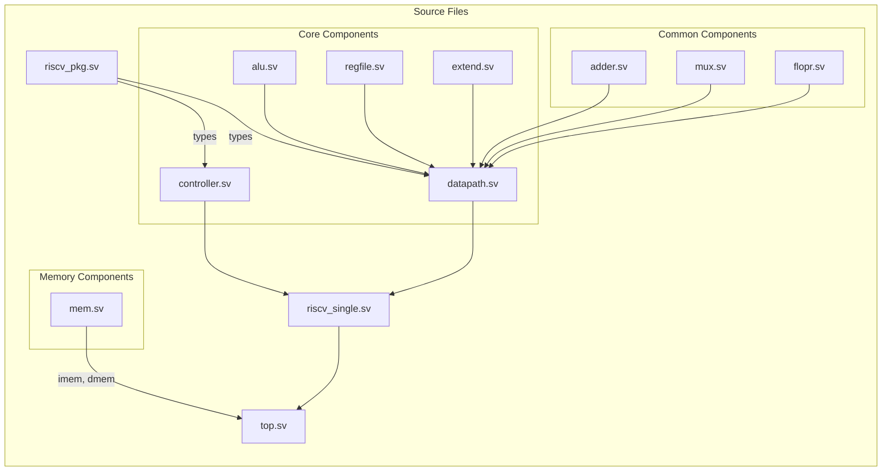
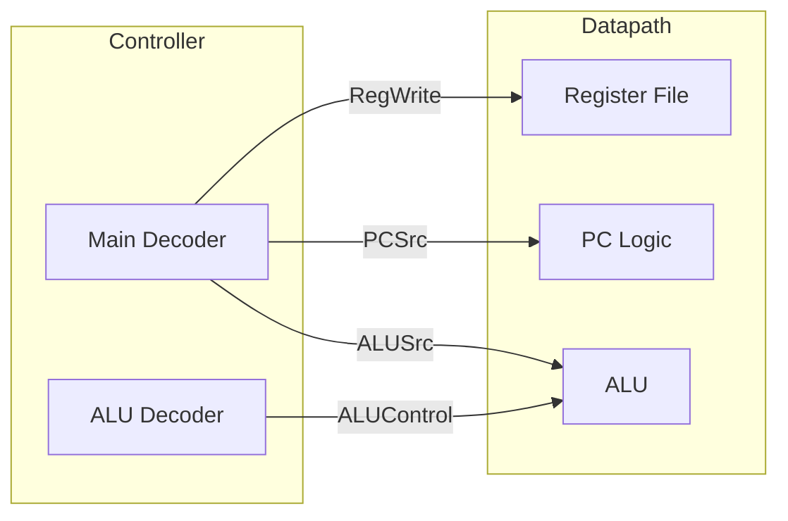

# Source Code Organization

The RISC-V single cycle processor implementation is organized into a modular directory structure that separates components by their functionality.

## Directory Structure



## Module Dependencies



## Component Descriptions

### Common Components
- **adder.sv**: Simple 32-bit adder used for PC increment and branch target calculation
- **mux.sv**: Multiplexer modules (2-to-1 and 3-to-1) for data selection
- **flopr.sv**: Flip-flops with synchronous reset for state storage

### Core Components
- **alu.sv**: Arithmetic Logic Unit implementing RISC-V arithmetic and logical operations
- **regfile.sv**: Register File with 32 registers, dual read ports, and single write port
- **extend.sv**: Sign extension unit for different instruction formats
- **controller.sv**: Main control unit including instruction decoder and ALU control
- **datapath.sv**: Main datapath connecting all components and implementing data flow

### Memory Components
- **mem.sv**: Instruction and data memory modules (imem and dmem)

### Top-Level Files
- **riscv_pkg.sv**: Package containing common type definitions and parameters
- **riscv_single.sv**: Top-level processor module connecting controller and datapath
- **top.sv**: System top-level including processor and memories

## Key Interfaces

### Datapath-Controller Interface


### Memory Interface
```mermaid
graph LR
    subgraph Processor
        pc[PC]
        alu[ALU]
        regfile[Register File]
    end
    
    subgraph Memory
        imem[Instruction Memory]
        dmem[Data Memory]
    end
    
    pc --> |address| imem
    imem --> |instruction| Processor
    alu --> |address| dmem
    regfile --> |write data| dmem
    dmem --> |read data| regfile
